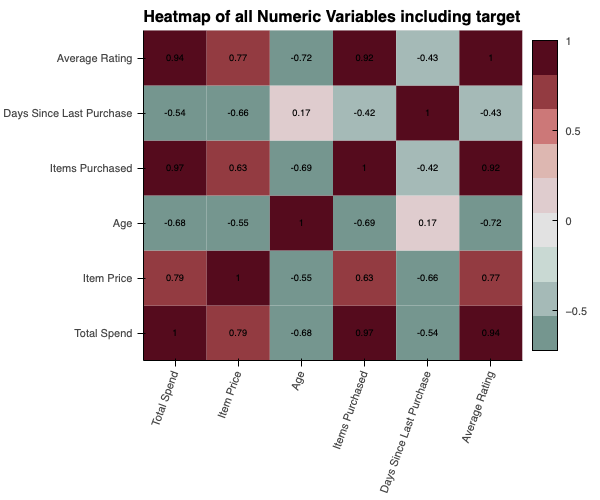
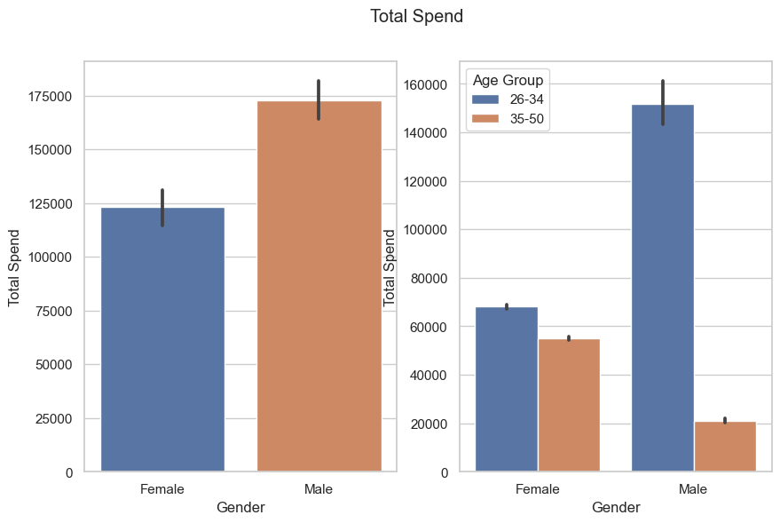
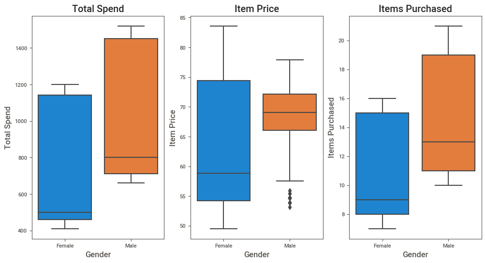
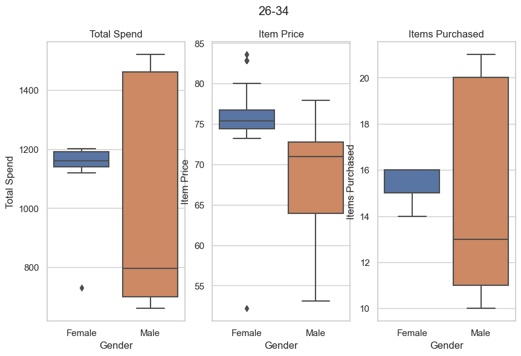
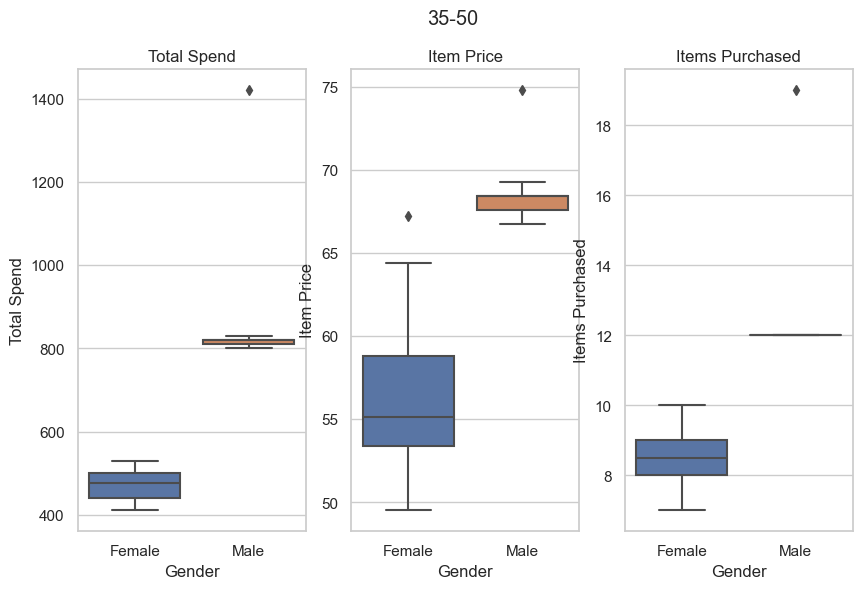

# EDA Results Report – E-Commerce Customer Data

Data set is available via link: [https://www.kaggle.com/datasets/uom190346a/e-commerce-customer-behavior-dataset]

## Key Areas to Investigate

### 1. Customer Segmentation & Profiles
	•	Which groups of customers spend the most? (by Age, Gender, City, Membership Type)
	•	Do certain membership types lead to higher spend or purchase frequency?
	•	Are younger vs. older customers different in terms of satisfaction and loyalty?

### 2. Customer Lifetime Value (CLV)
	•	Which features (membership, discount usage, rating) are linked to higher long-term spend?
	•	Do frequent discounts reduce or increase CLV?

### 3. Shopping Behavior
	•	Correlation between Total Spend and Items Purchased (big baskets vs. high-value items).
	•	Impact of discounts on spend (are discount-heavy customers actually valuable?).
	•	Relationship between Days Since Last Purchase and likelihood of churn.

### 4. Satisfaction & Ratings
	•	Do satisfaction levels differ across membership tiers or cities?
	•	Does Average Rating predict higher spend or repeat purchases?
	•	Are dissatisfied customers more price-sensitive (use discounts more)?

### 5. Churn Analysis
	•	Customers with high Days Since Last Purchase: what patterns do they share (e.g., low satisfaction, low spend, certain cities)?
	•	Can we predict who is likely to churn?

### 6. Marketing & Retention Opportunities
	•	Identify high-value segments to target with loyalty perks.
	•	Find low-satisfaction but high-spend customers → critical to retain.
	•	Compare customers who use discounts often vs. rarely to optimize pricing strategy.
⸻⸻⸻⸻⸻⸻⸻⸻⸻⸻⸻⸻⸻⸻⸻⸻⸻⸻⸻⸻⸻⸻⸻⸻
 ## Findings and results

### 1. Overview
	•	Dataset size: 350 customers, 11 features.
	•	Period covered: Date range is not  available.

 	Columns:
  
**Customer ID:** Type: Numeric Description: A unique identifier assigned to each customer, ensuring distinction across the dataset.
**Gender:** Type: Categorical (Male, Female) Description: Specifies the gender of the customer, allowing for gender-based analytics. 
**Age:** Type: Numeric Description: Represents the age of the customer, enabling age-group-specific insights.
**Age Group:** Type: Categorical (18-25, 26-34, 35-50) Description: Represents the age of the customer.
**City:** Type: Categorical (City names) Description: Indicates the city of residence for each customer, providing geographic insights.
**Membership Type:** Type: Categorical (Gold, Silver, Bronze) Description: Identifies the type of membership held by the customer, influencing perks and benefits.
**Total Spend: Type:** Numeric Description: Records the total monetary expenditure by the customer on the e-commerce platform.
**Items Purchased:** Type: Numeric Description: Quantifies the total number of items purchased by the customer.
**Average Rating:** Type: Numeric (0 to 5, with decimals) Description: Represents the average rating given by the customer for purchased items, gauging satisfaction.
**Discount Applied:** Type: Boolean (True, False) Description: Indicates whether a discount was applied to the customer's purchase, influencing buying behavior.
**Days Since Last Purchase:** Type: Numeric Description: Reflects the number of days elapsed since the customer's most recent purchase, aiding in retention analysis.
**Satisfaction Level:** Type: Categorical (Satisfied, Neutral, Unsatisfied) Description: Captures the overall satisfaction level of the customer, providing a subjective measure of their experience.

					

⸻

### 2. Customer Segmentation & Profiles
  •	Average customer age: [33.6 years, 36.4 years - females, 30.8 - males].
	•	Gender distribution: [50% Female, 50% Male].
	•	Customer groups with highest spend: 
		
		Men spend more: they buy more expensive goods and more items. When gender groups are broken down into age subgroups, it is clear that men aged 26 to 34 are the group with the highest spending.
		At the same time, women in this group also spend more than women in the 35-50 age group.	

	
	
	
		If we take a closer look at the difference in consumption between age groups, we can see the following:
		
		Age Group 26-34
	•	Females: Show a very tight distribution, consistently spending around 1,150–1,200.Tend to purchase higher-priced items, with a median around 75–76. Their spending distribution is narrow, suggesting stable purchasing behavior.
	•	Males: Have a much wider spread, ranging roughly from 650 to 1,450+. Median spend is significantly lower than females (≈800 vs ≈1,170).Median item price is lower (≈71), with a wider spread extending down to ≈55.
	
	  Insight: Females in this age group spend more consistently and at a higher level, while males are more variable, with some very high spenders but many spending much less.Females generally favor premium-priced items, while males are more diverse, with many buying lower-priced items.Females buy fewer but steady amounts, while males show more fluctuation, with some buying substantially more. 
	 

 Age Group 35-50
	 •	Females: Spending is lower overall, with a median around 470–500, and fairly consistent (tight interquartile range).Median item price is around 55, but there’s wide variation (≈49–65).Buy fewer items, with a median around 8–9 and a compact distribution.
	 •	Males: Spend significantly more, with a median just above 800. However, there is an extreme outlier exceeding 1,400, showing that a few men spend exceptionally high amounts. Purchase higher-priced items more consistently, with a narrow range around 67–69.Purchase slightly more on average (median ≈12), with one notable outlier close to 19.
	 
	 Insight: Males are the dominant spenders in this age group, while females contribute less and remain more consistent. Males lean towards premium products, while females have a wider spread, including more budget-conscious purchases. Men in this age group not only spend more but also buy more items.
 

	
	## Do certain membership types lead to higher spend or purchase frequency?
	## Are younger vs. older customers different in terms of satisfaction and loyalty?
	
	
		
	